# Nginx

# 1、Nginx简介

## 1.1、Nginx概述

**Nginx** ("engine x") 是一个高性能的HTTP 和反向代理服务器,特点是占有内存少，并发能
力强，事实上nginx 的并发能力确实在同类型的网页服务器中表现较好，中国大陆使用nginx网站用户有：百度、京东、新浪、网易、腾讯、淘宝等

## 1.2、Nginx 作为web 服务器

Nginx 可以作为静态页面的web 服务器，同时还支持CGI 协议的动态语言，比如perl、php等。但是不支持java。Java 程序只能通过与tomcat 配合完成。Nginx 专为性能优化而开发，性能是其最重要的考量,实现上非常注重效率 ，能经受高负载的考验,有报告表明能支持高达 50,000 个并发连接数。

## 1.3、正向代理

如果把局域网外的Internet 想象成一个巨大的资源库，则局域网中的客户端要访
问Internet，则需要通过代理服务器来访问，这种代理服务就称为正向代理。


## 1.4、反向代理

我们只需要将请求发送到反向代理服务器，由反向代理服务器去选择目标服务器获取数据后，在返回给客户端，此时反向代理服务器和目标服务器对外就是一个服务器，暴露的是代理服务器地址，隐藏了真实服务器IP 地址。


## 1.5、负载均衡

单个服务器解决不了，我们增加服务器的数量，然后将请求分发到各个服务器上，将原先请求集中到单个服务器上的情况改为将请求分发到多个服务器上，将负载分发到不同的服务器，也就是我们所说的**负载均衡**


## 1.6、动静分离

为了加快网站的解析速度，可以把动态页面和静态页面由不同的服务器来解析，加快解析速
度。降低原来单个服务器的压力。


# 2、Nginx安装(1.18.0)

- 使用远程连接工具Xshell连接linux系统

- 在官网http://nginx.org下载Nginx

- nginx安装需要的依赖

  

  - 安装pcre依赖

    - 把安装压缩文件放到linux系统中
    - 解压压缩文件 执行 `tar -xvf pcre-8.37.tar.gz`
    - 进入解压之后的目录(cd pcre-8.37/)，执行`./configure`
    - 使用`make && make install` 命令
    - 安装后可以使用命令查看版本号`pcre-config --version`

  - 安装其他的依赖 直接运行命令

    ```shell
    yum -y install make zlib zlib-devel gcc-c++ libtool openssl openssl-devel
    ```

  - 安装nginx（同pcre安装过程）

- 安装成功后，在usr中会多出来一个文件夹local/nginx，在nginx中的sbin里有个启动脚本

- 启动Nginx 进入sbin目录，执行命令`./nginx`


```shell
#修改端口
cd /usr/local/nginx/conf
vi nginx.conf

#查看nginx是否启动
ps -ef | grep nginx 

#查看开放的端口号
firewall-cmd --list-all

#设置开放的端口号
sudo firewall-cmd --add-port=8010/tcp --permanent

#重启防火墙
firewall-cmd --reload
```


# 3、Nginx常用命令和配置文件

## 3.1、Nginx操作常用命令

> 使用nginx操作命令前提条件:必须进入nginx的目录 /usr/local/nginx/sbin

1. 查看Nginx版本号

   ```shell
   [root@localhost sbin]# ./nginx -v
   nginx version: nginx/1.18.0
   ```

2. 启动Nginx

   ```shell
   [root@localhost sbin]# ./nginx
   ```

3. 关闭Nginx

   ```shell
   [root@localhost sbin]# ./nginx -s stop
   ```

4. 重新加载Nginx

   ```shell
   [root@localhost sbin]# ./nginx -s reload
   ```


## 3.2、Nginx的配置文件

### 3.2.1、Nginx配置文件的位置

```shell
#conf文件夹中的nginx.conf文件
[root@localhost ~]# cd /usr/local/nginx/conf
```

### 3.2.2、Nginx配置文件的组成（由三部分组成）

1. 全局块

   **从配置文件开始到 events 块之间的内容，主要会设置一些影响nginx 服务器整体运行的配置指令**

   ```shell
   #举例
   worker_process 1; #表示Nginx处理并发的关键配置，worker_process值越大，可处理并发量越多
   ```

2. events块

   **events 块涉及的指令主要影响 Nginx 服务器与用户的网络连接**

   ```shell
   #举例
   worker_connections 1024;#Nginx支持的最大连接数
   ```

3. http块

   **这算是 Nginx 服务器配置中最频繁的部分，代理、缓存和日志定义等绝大多数功能和第三方模块的配置都在这里，http块又包括http全局块和server块**

   1. http全局块

      **http全局块配置的指令包括文件引入、MIME-TYPE 定义、日志自定义、连接超时时间、单链接请求数上限等。**

   2. server块

      ```shell
      listen       8010;#端口号
      server_name  localhost;#主机名称
      ```


# 4、Nginx配置示例-反向代理

## 4.1、反向代理实例1

实现效果：打开浏览器，使用Nginx反向代理访问 www.123.com,跳转到linux系统tomcat主页面

> 需在Linux系统安装Tomcat 

1. 官网下载Tomcat的tar安装包
2. 安装包传到Linux系统
3. `tar -xvf 文件名`解压
4. 在`bin`目录下 执行`./startup.sh`启动tomcat

> 对外开放访问端口 重启防火墙

```shell
sudo firewall-cmd --add-port=8080/tcp --permanent
firewall-cmd --reload
```


> 浏览器访问tomcat

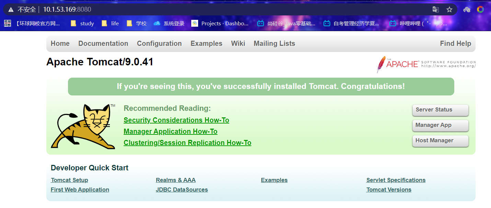

> 访问过程分析

输入网址www.123.com后首先去本地host文件查看是否有配置 没有的话再联网查找网站


### 4.1.1 具体配置

> 在windows系统的host文件进行域名和ip对应关系的配置

1. 首先找到hosts文件

   

2. 打开 最后一行添加一段

   ```shell
   10.1.53.169 www.123.com
   ```

3. 在Nginx进行请求转发的配置(反向代理)

   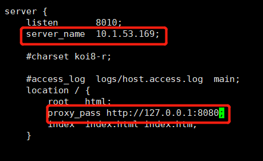

   设置完成后 访问10.1.53.169:8010时会自动转发到127.0.0.1:8080

4. 最终测试

   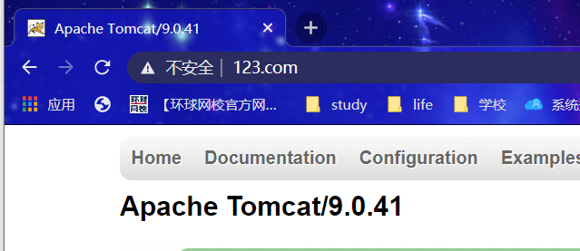


## 4.2、反向代理实例2

实现效果：使用nginx反向代理，根据访问的路径跳转到不同端口的服务中

​				nginx监听的端口为9001

​				访问http://10.1.53.169:9001/edu/ 直接跳转到127.0.0.1:8080

​				访问http://10.1.53.169:9001/vod/ 直接跳转到127.0.0.1:8081

> 准备两个Tomcat服务器 端口分别为8080和8081

1. 在linux系统创建两个文件夹 并放入安装包

   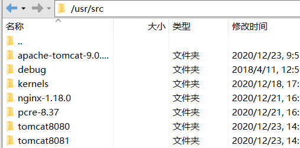

2. 解压出来后修改server.xml配置文件的端口号分别启动两个tomcat

> 创建文件夹和测试页面

在`tomcat8081/apache-tomcat-9.0.41/webapps/edu`中创建一个a.html 内容为8080

在 `tomcat8081/apache-tomcat-9.0.41/webapps/vod`中创建一个a.html内容为8081

通过请求路径`10.1.53.169:8080/edu/a.html`和`10.1.53.169:8081/vod/a.html`访问


### 4.2.1、具体配置

> 在Nginx的配置文件中进行反向代理配置

```shell
    # another virtual host using mix of IP-, name-, and port-based configuration
    #
    server {
        listen       9001;
        server_name  10.1.53.169;

        location ~ /edu/ {
           proxy_pass   http://127.0.0.1:8080;
        }
        location ~ /vod/ {
           proxy_pass   http://127.0.0.1:8081;
        }
    }

```

> 最终测试

10.1.53.169:9001/edu/a.html  ——>  服务器的127.0.0.1:8080/edu/a.html


10.1.53.169:9001/vod/a.html ——> 服务器的127.0.0.1:8081/vod/a.html


### 4.2.2、location指令说明

> URI请求路径

语法：

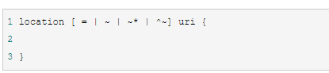

1.  ~：用于表示 uri 包含正则表达式，并且区分大小写。
2.  ~*：用于表示 uri 包含正则表达式，并且不区分大小写。


# 5、Nginx配置示例-负载均衡

**实现效果**：浏览器地址栏输入地址请求，http://10.1.53.169/edu/a.html,负载均衡，平均分配到8080和8081端口

要求：

1. 准备两台tomcat服务器 8080和8081端口 
2. 在两台tomcat里webapps目录中，创建名称为edu文件夹，在edu文件夹中创建页面a.html用于测试


> **在nginx.conf中进行配置**


> Nginx的分配服务器策略

1. 轮询（默认）

   每个请求按时间顺序逐一分配到不同的后端服务器，如果后端服务器down掉，能自动剔除。

2. weight

   weight代表权重默认为1，权重越高被分配的客户端越多 

   ```shell
       upstream myserver{
           server  10.1.53.169:8080 weight=5;
           server  10.1.53.169:8081 weight=10;
       }
   ```

3. ip_hash（首次访问了的一个服务器，后面进入都会一直访问这个服务器）

   每个请求按访问ip的hash结果分配，每个访客固定访问一个后端服务器，可以解决session的问题

   ```shell
       upstream myserver{
       	ip_hash;
           server  10.1.53.169:8080;
           server  10.1.53.169:8081;
       }
   ```

4. fair(第三方)

   按后端服务器的响应时间来分配请求，响应时间短的优先分配

   ```shell
       upstream myserver{
           server  10.1.53.169:8080;
           server  10.1.53.169:8081;
       	fair;
       }
   ```


# 6、Nginx配置实例-动静分离

> 动静分离的概念

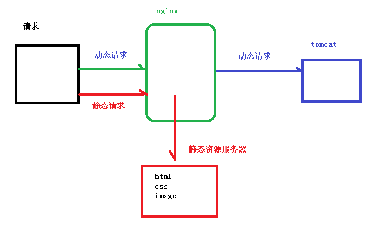

> 动静分离从实现角度分为两种

1. 纯粹把静态文件独立成单独的域名，放在独立的服务器上，也是目前主流推崇的方案； 
2. 另外一种方法就是动态跟静态文件混合在一起发布，通过 nginx 来分开。


要求：

1. 在Linux系统中准备静态资源，用于进行访问

   


> Nginx.conf具体配置

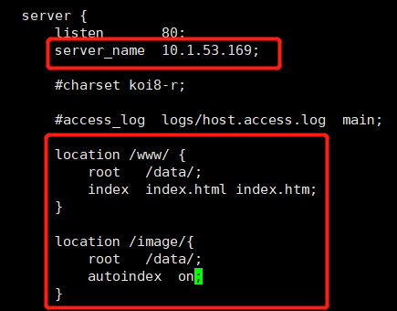


> 测试

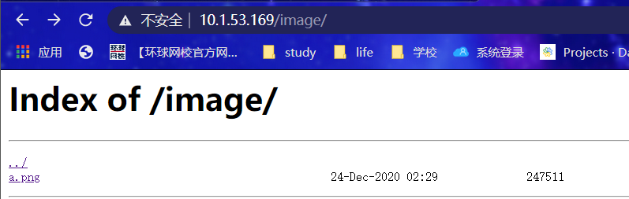

```shell
#作用是列出当前文件夹的内容
autoindex on 
```

**10.1.53.169/image/a.png**


**10.1.53.169/www/a.html**


# 7、Nginx配置高可用的集群

> 概念

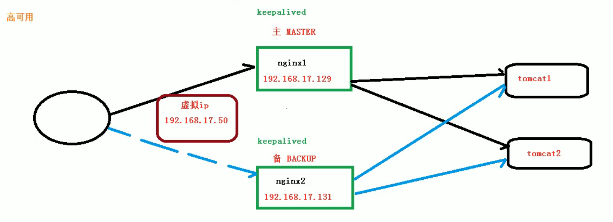

要求：

1. 需要两台nginx服务器
2. 需要keepalived
3. 需要虚拟ip


> 配置高可用的集群准备

1. 需要两台服务器 10.1.53.169 和 192.168.247.128

2. 在两台服务器安装nginx

3. 在两台服务器安装keepalived

   ```shell
   #用yum命令进行安装
   yum install keepalived -y
   #查询是否安装成功
   rpm -q -a keepalived
   ```

   keepalived存在于/etc/keepalived中有个keepalived.conf配置文件

> 配置

1. 修改两个服务器的/etc/keepalived/keepalived.conf配置文件

   ```shell
   global_defs {
       notification_email {
           2473758409@qq.com
       }
       notification_email_from sns-lvs@gmail.com
       smtp_server 10.1.53.169
       smtp_connection_timeout 30
       router_id nginx_master        # 设置nginx master的id，在一个网络应该是唯一的
   }
   vrrp_script chk_http_port {
       script "/usr/local/src/nginx_check.sh"    #最后手动执行下此脚本，以确保此脚本能够正常执行
       interval 2                          #（检测脚本执行的间隔，单位是秒）
       weight 2
   }
   vrrp_instance VI_1 {
       state MASTER            # 指定keepalived的角色，MASTER为主，BACKUP为备
       interface ens33            # 当前进行vrrp通讯的网络接口卡(当前centos的网卡)
       virtual_router_id 66        # 虚拟路由编号，主从要一直
       priority 100            # 优先级，数值越大，获取处理请求的优先级越高
       advert_int 1            # 检查间隔，默认为1s(vrrp组播周期秒数)
       authentication {
           auth_type PASS
           auth_pass 1111
       }
       track_script {
       chk_http_port            #（调用检测脚本）
       }
       virtual_ipaddress {
           10.1.53.177            # 定义虚拟ip(VIP)，可多设，每行一个
       }
   }
   ```
   
2. 在/usr/local/src中添加检测脚本nginx_check.sh（检测nginx是否存活）

   ```shell
   #!/bin/bash
   
   A=`ps -C nginx –no-header |wc -l`
   
   if [ $A -eq 0 ];then
   
   	/usr/local/nginx/sbin/nginx
   
   	sleep 2
   
   	if [ `ps -C nginx --no-header |wc -l` -eq 0 ];then
   
   	killall keepalived
   
   	fi
   
   fi
   ```

3. 把两台服务器上的nginx和keepalived启动

   ```shell
   #启动keepalived
   systemctl start keepalived.service
   #检查是否启动
   ps -ef | grep keepalived
   ```


> 测试

1. 在浏览器访问虚拟IP地址10.1.53.177

   

   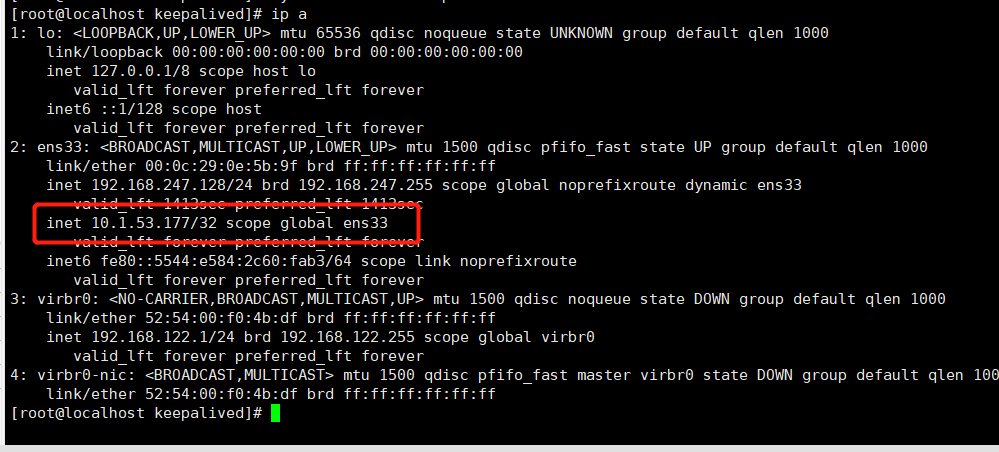

   

2. 把主服务器（192.168.247.128）的nginx和keepalived关闭，再进入虚拟IP

   ```shell
   #关闭keepalived
   systemctl stop keepalived.service
   ```

   效果：虚拟IP(10.1.53.177)访问从服务器的nginx

   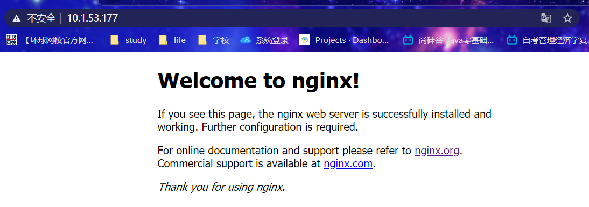

